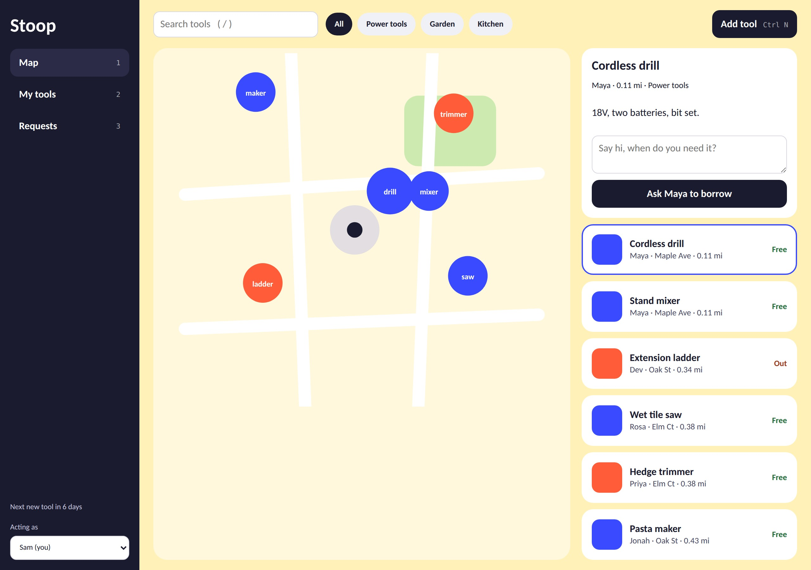

# Stoop: A neighborhood tool-borrowing tracker

Neighborhood tool-lending, as a Django app in a native desktop window.

    pip install -r requirements.txt
    python run_desktop.py

The launcher migrates the SQLite DB, seeds demo neighbors, starts Django on a free
local port and opens it in a pywebview window (falls back to your browser).
Dev mode: `python manage.py makemigrations lending && python manage.py migrate && python manage.py runserver`.

Shortcuts: `/` search, `Ctrl/Cmd N` add tool, `1 2 3` switch views.

Draft limits: one local database and an "Acting as" switcher stand in for real accounts.
Next steps: auth + a hosted sync server so neighbors share data, photos, due dates, packaging with PyInstaller.
